# gitlab
git data lab

How does git work?

1.	It stores snapshots, not differences
Git thinks of its data more like a series of snapshots of a miniature filesystem. With Git, every time you commit, or save the state of your project, Git basically takes a picture of what all your files look like at that moment and stores a reference to that snapshot. To be efficient, if files have not changed, Git doesn’t store the file again, just a link to the previous identical file it has already stored. Git thinks about its data more like a stream of snapshots.

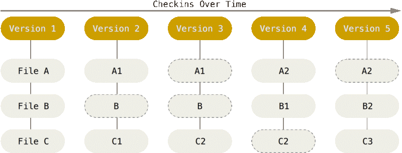

Figure 5. Storing data as snapshots of the project over time.

2.	Nearly Every Operation Is Local
Most operations in Git need only local files and resources to operate — generally no information is needed from another computer on your network.
For example, to browse the history of the project, Git doesn’t need to go out to the server to get the history and display it for you — it simply reads it directly from your local database. This means you see the project history almost instantly. If you want to see the changes introduced between the current version of a file and the file a month ago, Git can look up the file a month ago and do a local difference calculation, instead of having to either ask a remote server to do it or pull an older version of the file from the remote server to do it locally.
This also means that there is very little you can’t do if you’re offline or off VPN. If you get on an airplane or a train and want to do a little work, you can commit happily (to your local copy, remember?) until you get to a network connection to upload. If you go home and can’t get your VPN client working properly, you can still work.

3.	Git Has Integrity
Everything in Git is check-summed before it is stored and is then referred to by that checksum.
(a checksum is a small piece of information derived from all the data in order to detect errors from storing or moving the data). This means it’s impossible to change the contents of any file or directory without Git knowing about it. This functionality is built into Git at the lowest levels and is integral to its philosophy. You can’t lose information in transit or get file corruption without Git being able to detect it.
The mechanism that Git uses for this checksumming is called a SHA-1 hash. This is a 40-character string composed of hexadecimal characters (0–9 and a–f) and calculated based on the contents of a file or directory structure in Git. A SHA-1 hash looks something like this:
24b9da6552252987aa493b52f8696cd6d3b00373
You will see these hash values all over the place in Git because it uses them so much. In fact, Git stores everything in its database not by file name but by the hash value of its contents.

4.	Git Generally Only Adds Data
When you do actions in Git, nearly all of them only add data to the Git database. It is hard to get the system to do anything that is not undoable or to make it erase data in any way. As with any VCS, you can lose or mess up changes you haven’t committed yet, but after you commit a snapshot into Git, it is very difficult to lose, especially if you regularly push your database to another repository.
This makes using Git a joy because we know we can experiment without the danger of severely screwing things up.

5.	The Three States
Git has three main states that your files can reside in: committed, modified, and staged:
•	Committed means that the data is safely stored in your local database.
•	Modified means that you have changed the file but have not committed it to your database yet.
•	Staged means that you have marked a modified file in its current version to go into your next commit snapshot.

This leads us to the three main sections of a Git project: the Git directory, the working tree, and the staging area.

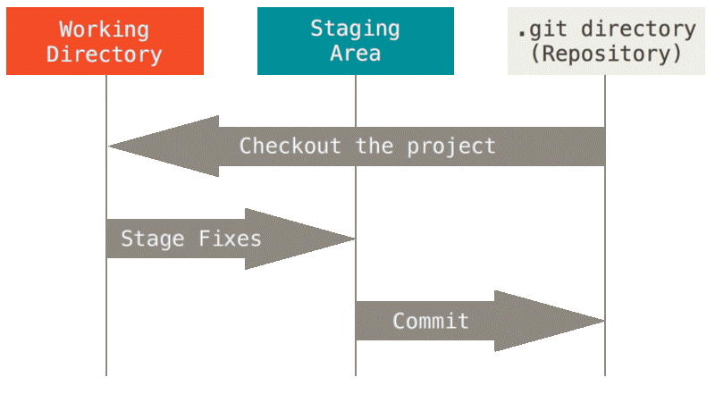

Figure 6. Working tree, staging area, and Git directory.
The Git directory is where Git stores the metadata and object database for your project. This is the most important part of Git, and it is what is copied when you clone a repository from another computer.

The working tree is a single checkout of one version of the project. These files are pulled out of the compressed database in the Git directory and placed on disk for you to use or modify.

The staging area is a file, generally contained in your Git directory, that stores information about what will go into your next commit. Its technical name in Git parlance is the “index”, but the phrase “staging area” works just as well.

The basic Git workflow goes something like this:
1.	You modify files in your working tree.
2.	You selectively stage just those changes you want to be part of your next commit, which adds only those changes to the staging area.
3.	You do a commit, which takes the files as they are in the staging area and stores that snapshot permanently to your Git directory.

If a particular version of a file is in the Git directory, it’s considered committed. If it has been modified and was added to the staging area, it is staged. And if it was changed since it was checked out but has not been staged, it is modified.

6.	Pointers and branches
When you make a commit, Git stores a commit object that contains a pointer to the snapshot of the content you staged. This object also contains the author’s name and email address, the message that you typed, and pointers to the commit or commits that directly came before this commit (its parent or parents): zero parents for the initial commit, one parent for a normal commit, and multiple parents for a commit that results from a merge of two or more branches.

To visualize this, let’s assume that you have a directory containing three files, and you stage them all and commit. Staging the files computes a checksum for each one, stores that version of the file in the Git repository (Git refers to them as blobs), and adds that checksum to the staging area:
“git add README test.rb LICENSE”
“git commit -m 'The initial commit of my project'”

When you create the commit by running git commit, Git checksums each subdirectory (in this case, just the root project directory) and stores those tree objects in the Git repository. Git then creates a commit object that has the metadata and a pointer to the root project tree so it can re-create that snapshot when needed.

Your Git repository now contains five objects: three blobs (each representing the contents of one of the three files), one tree that lists the contents of the directory and specifies which file names are stored as which blobs, and one commit with the pointer to that root tree and all the commit metadata.

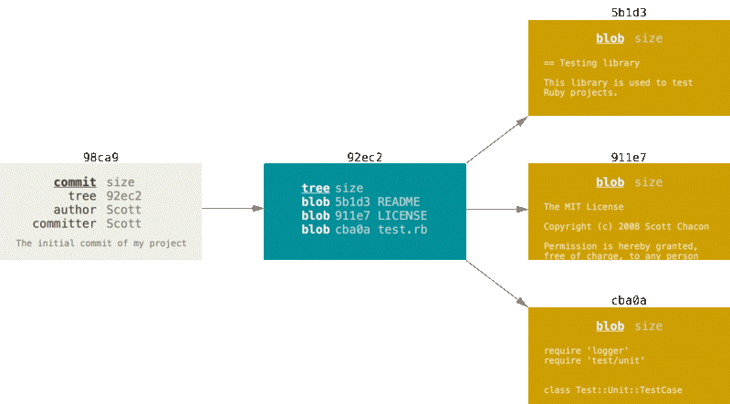

Figure 9. A commit and its tree

If you make some changes and commit again, the next commit stores a pointer to the commit that came immediately before it.

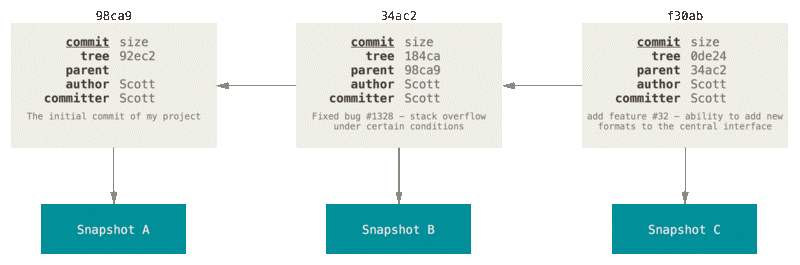

Figure 10. Commits and their parents

A branch in Git is simply a lightweight movable pointer to one of these commits. The default branch name in Git is master. As you start making commits, you’re given a master branch that points to the last commit you made. Every time you commit, the master branch pointer moves forward automatically.

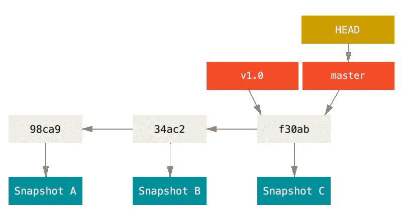

Figure 11. A branch and its commit history

7.	Creating a New Branch
What happens if you create a new branch? Well, doing so creates a new pointer for you to move around. Let’s say you want to create a new branch called testing.
“git branch testing”

This creates a new pointer to the same commit you’re currently on.

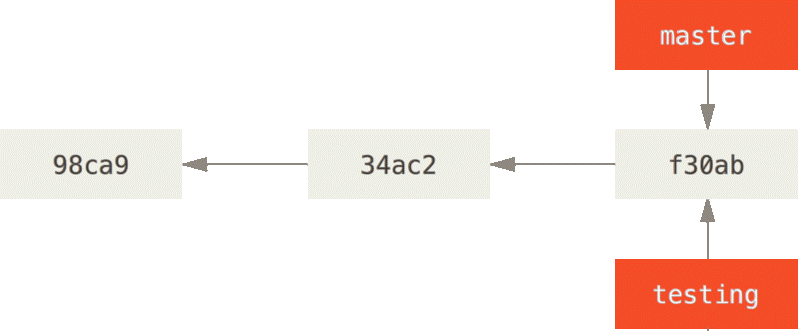

Figure 12. Two branches pointing into the same series of commits

How does Git know what branch you’re currently on? It keeps a special pointer called HEAD. In Git, this is a pointer to the local branch you’re currently on. In this case, you’re still on master. The git branch command only created a new branch — it didn’t switch to that branch.

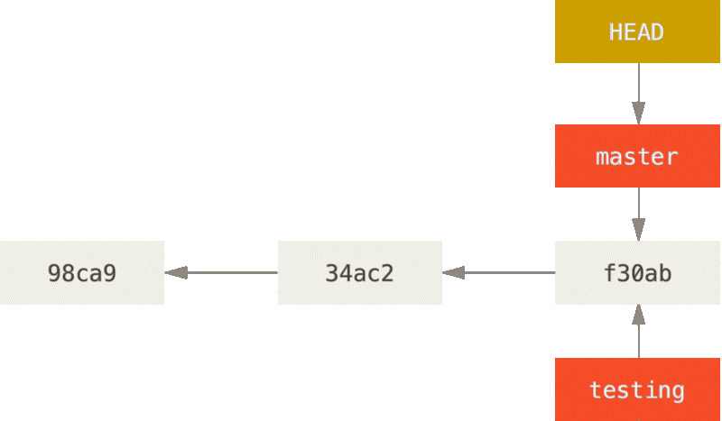

Figure 13. HEAD pointing to a branch

You can easily see this by running a simple git log command that shows you where the branch pointers are pointing. This option is called --decorate.
“git log --oneline –decorate”
Outputs:

f30ab (HEAD -> master, testing) add feature #32 - ability to add new formats to the central interface
34ac2 Fixed bug #1328 - stack overflow under certain conditions
98ca9 The initial commit of my project

You can see the “master” and “testing” branches that are right there next to the f30ab commit.

8.	Switching Branches
Let’s switch to the new testing branch:
“git checkout testing”
This moves HEAD to point to the testing branch.

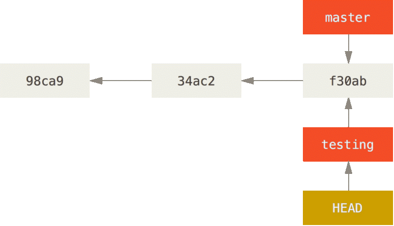

Figure 14. HEAD points to the current branch
What is the significance of that? Well, let’s do another commit:

“vim test.rb”
“git commit -a -m 'made a change'”

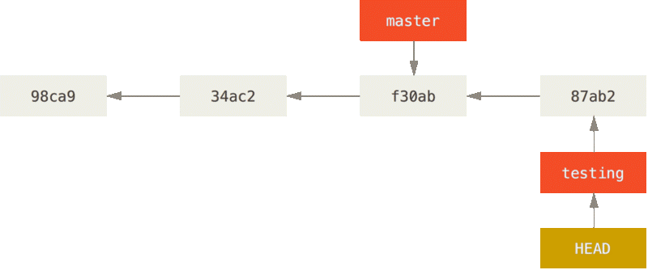

Figure 15. The HEAD branch moves forward when a commit is made

This is interesting, because now your testing branch has moved forward, but your master branch still points to the commit you were on when you ran git checkout to switch branches. Let’s switch back to the master branch:
“git checkout master”

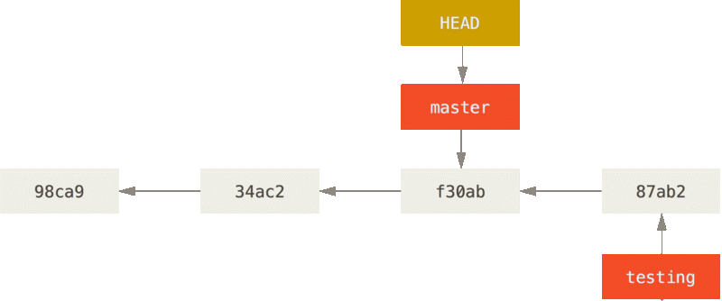

Figure 16. HEAD moves when you checkout

That command did two things. It moved the HEAD pointer back to point to the master branch, and it reverted the files in your working directory back to the snapshot that master points to. This also means the changes you make from this point forward will diverge from an older version of the project. It essentially rewinds the work you’ve done in your testing branch so you can go in a different direction.

Note	Switching branches changes files in your working directory
It’s important to note that when you switch branches in Git, files in your working directory will change. If you switch to an older branch, your working directory will be reverted to look like it did the last time you committed on that branch. If Git cannot do it cleanly, it will not let you switch at all.

Let’s make a few changes and commit again:
“vim test.rb”
“git commit -a -m 'made other changes'”

Now your project history has diverged. You created and switched to a branch, did some work on it, and then switched back to your main branch and did other work. Both of those changes are isolated in separate branches: you can switch back and forth between the branches and merge them together when you’re ready. And you did all that with simple branch, checkout, and commit commands.

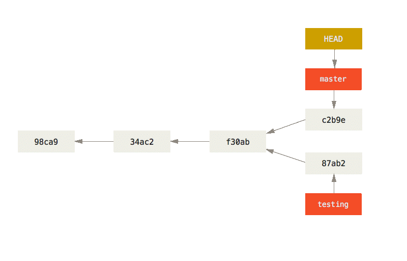

Figure 17. Divergent history

You can also see this easily with the git log command. If you run:
“git log --oneline --decorate --graph --all”
it will print out the history of your commits, showing where your branch pointers are and how your history has diverged.

* c2b9e (HEAD, master) made other changes
| * 87ab2 (testing) made a change
|/
* f30ab add feature #32 - ability to add new formats to the
* 34ac2 fixed bug #1328 - stack overflow under certain conditions
* 98ca9 initial commit of my project

Because a branch in Git is actually a simple file that contains the 40 character SHA-1 checksum of the commit it points to, branches are cheap to create and destroy. Creating a new branch is as quick and simple as writing 41 bytes to a file (40 characters and a newline).
This is in sharp contrast to the way most older VCS tools branch, which involves copying all of the project’s files into a second directory. This can take several seconds or even minutes, depending on the size of the project, whereas in Git the process is always instantaneous. Also, because we’re recording the parents when we commit, finding a proper merge base for merging is automatically done for us and is generally very easy to do. These features help encourage developers to create and use branches often.

9.	Reset Demystified
Before moving on to more specialized tools, let’s talk about the Git reset and checkout commands. These commands are two of the most confusing parts of Git when you first encounter them. They do so many things that it seems hopeless to actually understand them and employ them properly. For this, we recommend a simple metaphor.

Remember the three trees idea we’ve already used to explain git. By “tree” here, we really mean “collection of files”, not specifically the data structure. (There are a few cases where the index doesn’t exactly act like a tree, but for our purposes it is easier to think about it this way for now.)
Git as a system manages and manipulates three trees in its normal operation:

Tree	Role
HEAD	Last commit snapshot, next parent
Index	Proposed next commit snapshot
Working Directory	Sandbox

9.1	The HEAD
HEAD is the pointer to the current branch reference, which is in turn a pointer to the last commit made on that branch. That means HEAD will be the parent of the next commit that is created. It’s generally simplest to think of HEAD as the snapshot of your last commit on that branch.
In fact, it’s pretty easy to see what that snapshot looks like. Here is an example of getting the actual directory listing and SHA-1 checksums for each file in the HEAD snapshot:
“git cat-file -p HEAD”

tree cfda3bf379e4f8dba8717dee55aab78aef7f4daf
author Scott Chacon  1301511835 -0700
committer Scott Chacon  1301511835 -0700

initial commit
“git ls-tree -r HEAD”

100644 blob a906cb2a4a904a152...   README
100644 blob 8f94139338f9404f2...   Rakefile
040000 tree 99f1a6d12cb4b6f19...   lib

The Git cat-file and ls-tree commands are “plumbing” commands that are used for lower level things and not really used in day-to-day work, but they help us see what’s going on here.

9.2	The Index
The Index is your proposed next commit. We’ve also been referring to this concept as Git’s “Staging Area” as this is what Git looks at when you run git commit.
Git populates this index with a list of all the file contents that were last checked out into your working directory and what they looked like when they were originally checked out. You then replace some of those files with new versions of them, and git commit converts that into the tree for a new commit.

“git ls-files -s”

100644 a906cb2a4a904a152e80877d4088654daad0c859 0	README
100644 8f94139338f9404f26296befa88755fc2598c289 0	Rakefile
100644 47c6340d6459e05787f644c2447d2595f5d3a54b 0	lib/simplegit.rb

Again, here we’re using git ls-files, which is more of a behind the scenes command that shows you what your index currently looks like.

9.3	The Working Directory
Finally, you have your working directory. The other two trees store their content in an efficient but inconvenient manner, inside the .git folder. The Working Directory unpacks them into actual files, which makes it much easier for you to edit them. Think of the Working Directory as a sandbox, where you can try changes out before committing them to your staging area (index) and then to history.
$ tree
.
├── README
├── Rakefile
└── lib
    └── simplegit.rb

1 directory, 3 files

10.	The Workflow
Git’s main purpose is to record snapshots of your project in successively better states, by manipulating these three trees.

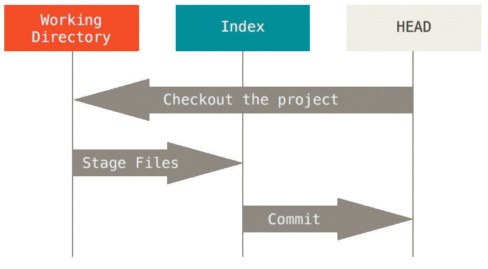

Let’s visualize this process: go a git repository, and edit a file. It will be indicated as v2, in red.

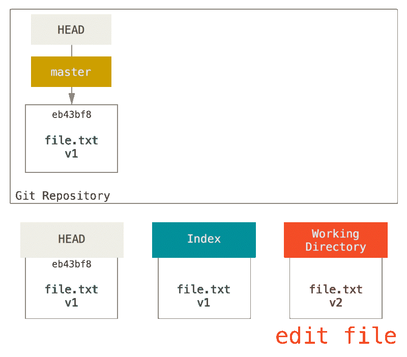

If we run git status right now, we’ll see the file in red as “Changes not staged for commit,” because that entry differs between the Index and the Working Directory. Next we run git add on it to stage it into our Index.

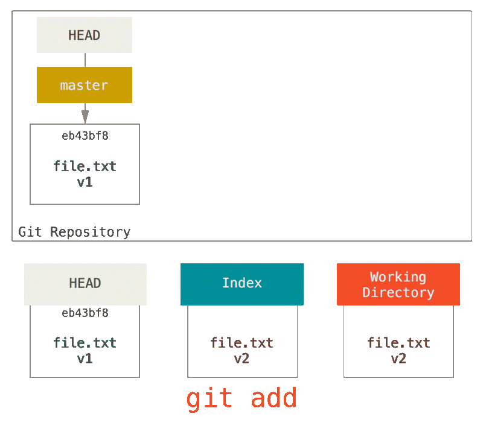

At this point, if we run git status, we will see the file in green under “Changes to be committed” because the Index and HEAD differ — that is, our proposed next commit is now different from our last commit. Finally, we run git commit to finalize the commit.

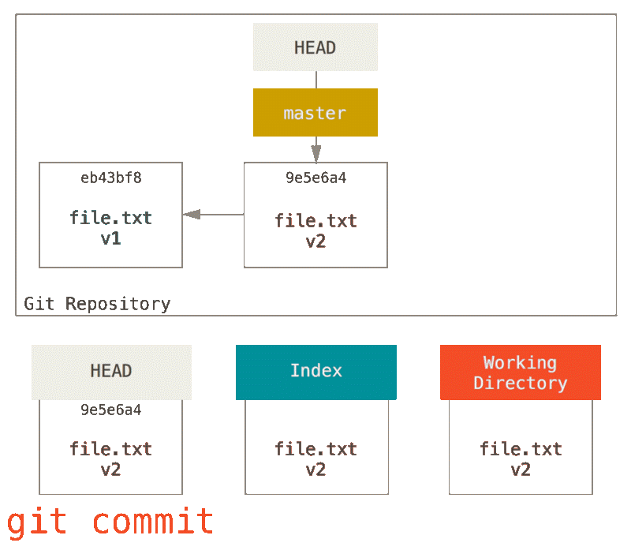

Now git status will give us no output, because all three trees are the same again.
Switching branches or cloning goes through a similar process. When you checkout a branch, it changes HEAD to point to the new branch ref, populates your Index with the snapshot of that commit, then copies the contents of the Index into your Working Directory.

And finally. Now that we understand git better, we may wanna use this to go back to previous commits.

11.	The Role of Reset
The reset command makes more sense when viewed in this context.
For the purposes of these examples, let’s say that we’ve modified file.txt again and committed it a third time. So now our history looks like this:

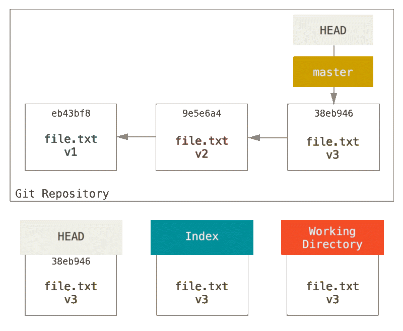

Let’s now walk through exactly what reset does when you call it. It directly manipulates these three trees in a simple and predictable way. It does up to three basic operations. Depending on the arguments supplied.

Step 1: Move HEAD
The first thing reset will do is move what HEAD points to. This isn’t the same as changing HEAD itself (which is what checkout does); reset moves the branch that HEAD is pointing to. This means if HEAD is set to the master branch (i.e. you’re currently on the master branch), running git reset 9e5e6a4 will start by making master point to 9e5e6a4.

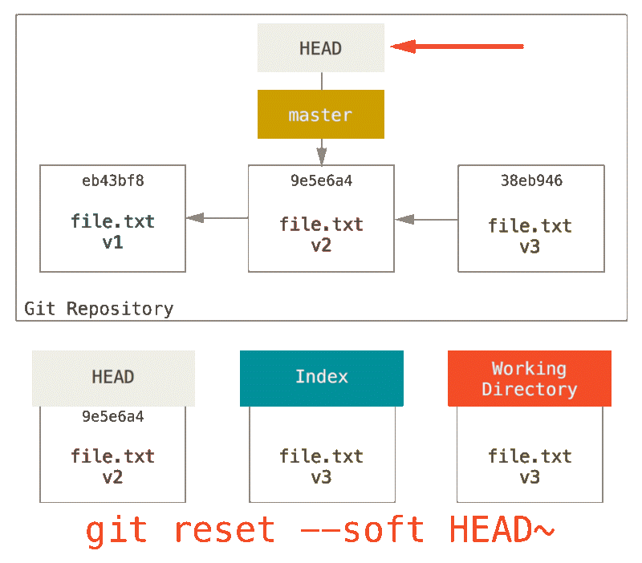

No matter what form of reset with a commit you invoke, this is the first thing it will always try to do. With reset --soft, it will simply stop there.

Now take a second to look at that diagram and realize what happened: it essentially undid the last git commit command. When you run git commit, Git creates a new commit and moves the branch that HEAD points to up to it. When you reset back, you are moving the branch back to where it was, without changing the Index or Working Directory. You could now update the Index and run git commit again to accomplish what git commit --amend would have done.
Note that if you run git status now you’ll see in green the difference between the Index and what the new HEAD is.

Step 2: Updating the Index (--mixed)
The next thing reset will do is to update the Index with the contents of whatever snapshot HEAD now points to.

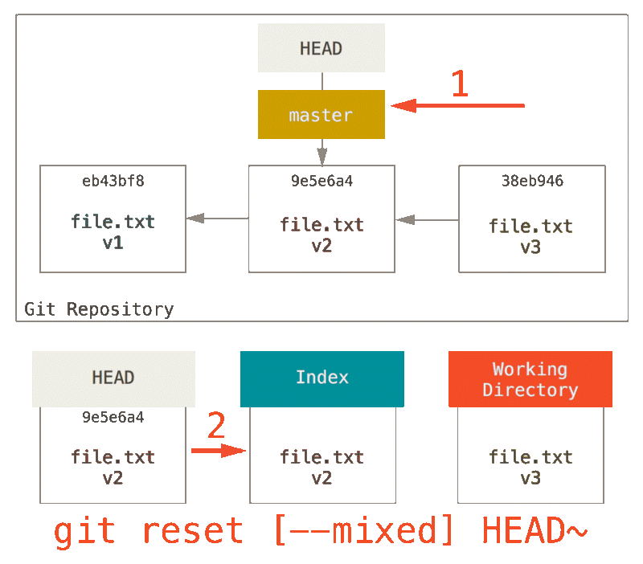

If you specify the --mixed option, reset will stop at this point. This is also the default, so if you specify no option at all, this is where the command will stop.
Now take another second to look at that diagram and realize what happened: it still undid your last commit, but also unstaged everything. You rolled back to before you ran all your git add and git commit commands.
Note that if you run git status now you’ll see in red the difference between the new Index and is in the working directory.

Step 3: Updating the Working Directory (--hard)
The third thing that reset will do is to make the Working Directory look like the Index. If you use the --hard option, it will continue to this stage.

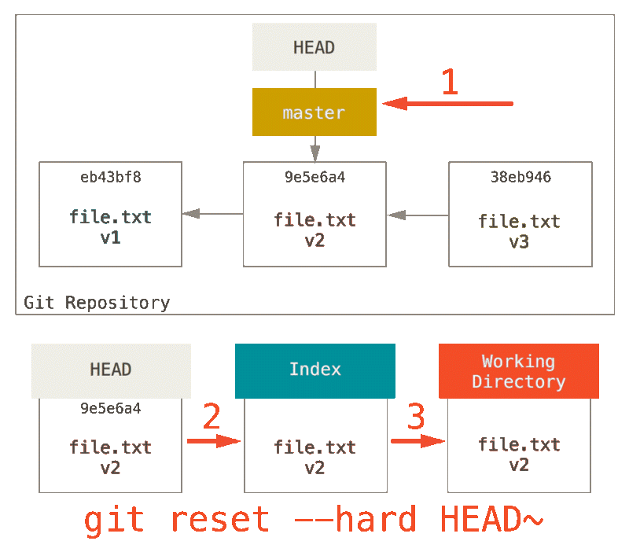

So let’s think about what just happened. You undid your last commit, the git add and git commit commands, and all the work you did in your working directory.
It’s important to note that this flag (--hard) is the only way to make the reset command dangerous, and one of the very few cases where Git will actually destroy data. Any other invocation of reset can be pretty easily undone, but the --hard option cannot, since it forcibly overwrites files in the Working Directory. In this particular case, we still have the v3 version of our file in a commit in our Git DB, and we could get it back by looking at our reflog, but if we had not committed it, Git still would have overwritten the file and it would be unrecoverable.

Recap
The reset command overwrites these three trees in a specific order, stopping when you tell it to:
1.	Move the branch HEAD points to (stop here if --soft)
2.	Make the Index look like HEAD (stop here unless --hard)
3.	Make the Working Directory look like the Index

Reset With a Path
That covers the behavior of reset in its basic form, but you can also provide it with a path to act upon. If you specify a path, reset will skip step 1, and limit the remainder of its actions to a specific file or set of files. This actually sort of makes sense — HEAD is just a pointer, and you can’t point to part of one commit and part of another. But the Index and Working directory can be partially updated, so reset proceeds with steps 2 and 3.
So, assume we run git reset file.txt. This form (since you did not specify a commit SHA-1 or branch, and you didn’t specify --soft or --hard) is shorthand for git reset --mixed HEAD file.txt, which will:
1.	Move the branch HEAD points to (skipped)
2.	Make the Index look like HEAD (stop here)
So it essentially just copies file.txt from HEAD to the Index.

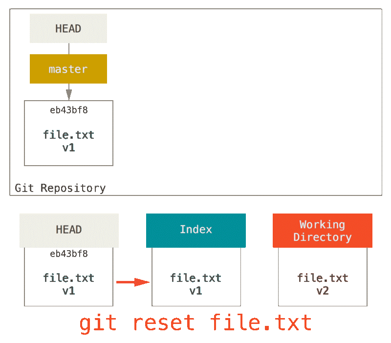

This has the practical effect of unstaging the file. If we look at the diagram for that command and think about what git add does, they are exact opposites.

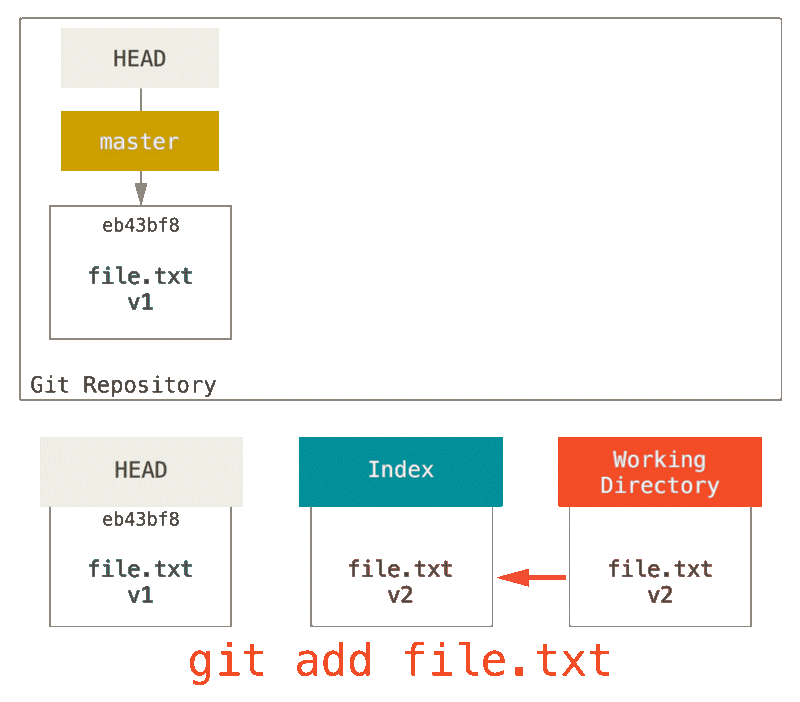

This is why the output of the git status command suggests that you run this to unstage a file.
We could just as easily not let Git assume we meant “pull the data from HEAD” by specifying a specific commit to pull that file version from. We would just run something like git reset eb43bf file.txt.

This effectively does the same thing as if we had reverted the content of the file to v1 in the Working Directory, ran git add on it, then reverted it back to v3 again (without actually going through all those steps). If we run git commit now, it will record a change that reverts that file back to v1, even though we never actually had it in our Working Directory again.
It’s also interesting to note that like git add, the reset command will accept a --patch option to unstage content on a hunk-by-hunk basis. So you can selectively unstage or revert content.

Squashing
Let’s look at how to do something interesting with this newfound power — squashing commits.
Say you have a series of commits with messages like “oops.”, “WIP” and “forgot this file”. You can use reset to quickly and easily squash them into a single commit that makes you look really smart.
Let’s say you have a project where the first commit has one file, the second commit added a new file and changed the first, and the third commit changed the first file again. The second commit was a work in progress and you want to squash it down.

You can run git reset --soft HEAD~2 to move the HEAD branch back to an older commit (the most recent commit you want to keep):

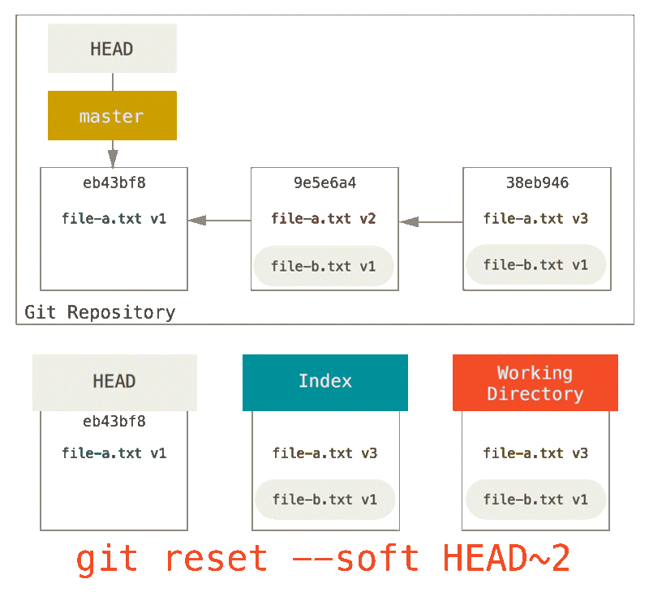

And then simply run git commit again:

Now you can see that your reachable history, the history you would push, now looks like you had one commit with file-a.txt v1, then a second that both modified file-a.txt to v3 and added file-b.txt. The commit with the v2 version of the file is no longer in the history.

Check It Out
Finally, you may wonder what the difference between checkout and reset is. Like reset, checkout manipulates the three trees, and it is a bit different depending on whether you give the command a file path or not.

Without Paths
Running git checkout [branch] is pretty similar to running git reset --hard [branch] in that it updates all three trees for you to look like [branch], but there are two important differences.

First, unlike reset --hard, checkout is working-directory safe; it will check to make sure it’s not blowing away files that have changes to them. Actually, it’s a bit smarter than that — it tries to do a trivial merge in the Working Directory, so all of the files you haven’t changed will be updated. reset --hard, on the other hand, will simply replace everything across the board without checking.

The second important difference is how checkout updates HEAD. Whereas reset will move the branch that HEAD points to, checkout will move HEAD itself to point to another branch.

For instance, say we have master and develop branches which point at different commits, and we’re currently on develop (so HEAD points to it). If we run git reset master, develop itself will now point to the same commit that master does. If we instead run git checkout master, develop does not move, HEAD itself does. HEAD will now point to master.

So, in both cases we’re moving HEAD to point to commit A, but how we do so is very different. reset will move the branch HEAD points to, checkout moves HEAD itself.

With Paths
The other way to run checkout is with a file path, which, like reset, does not move HEAD. It is just like git reset [branch] file in that it updates the index with that file at that commit, but it also overwrites the file in the working directory. It would be exactly like git reset --hard [branch] file (if reset would let you run that) — it’s not working-directory safe, and it does not move HEAD.

Summary
Hopefully now you understand and feel more comfortable with the reset command, but are probably still a little confused about how exactly it differs from checkout and could not possibly remember all the rules of the different invocations.
Here’s a cheat-sheet for which commands affect which trees. The “HEAD” column reads “REF” if that command moves the reference (branch) that HEAD points to, and “HEAD” if it moves HEAD itself. Pay especial attention to the WD Safe? column — if it says NO, take a second to think before running that command.

	HEAD	Index	Workdir	WD Safe?
Commit Level				
reset --soft [commit]	REF	NO	NO	YES
reset [commit]	REF	YES	NO	YES
reset --hard [commit]	REF	YES	YES	NO
checkout <commit>	HEAD	YES	YES	YES
File Level				
reset [commit] <paths>	NO	YES	NO	YES
checkout [commit] <paths>	NO	YES	YES	NO
https://git-scm.com/book/en/v2/Git-Branching-Basic-Branching-and-Merging
https://git-scm.com/book/en/v2/Git-Tools-Reset-Demystified#_git_reset
https://git-scm.com/book/en/v2/Git-Branching-Branches-in-a-Nutshell#ch03-git-branching
https://git-scm.com/book/en/v2/Getting-Started-Git-Basics

 
Git Flow:

Find a spot on your pc/home folder where you want this set of work to be
From there, in terminal, type “git clone XXXXXXXXXXXXXXXXXXX”
-	This creates a copy of the remote repository in your local instance.
-	For Kieron, make sure this repository exists beforehand. It will contain a readme with all this info
-	Make sure there is already a master branch.

“git branch” will tell you what branch you are on. The master branch is the one that is in production. Running anything on this branch must always work. This branch should not be changed until we know the changes will 100% work without a hitch. The changes to master are never made directly on master, they are made via merges from other branches. We will get back to this.
“git branch” should tell you that this exists.
“git branch -a” will also show you all the branches that exist on the remote repository that you didn’t pull through already. You likely won’t need them, as they wouldn’t be your branches. For example in this case you’ll see a bunch of the branches I set up to test this lab.
“git branch -v” will show you the last commit on each branch.

For each person developing some of their own work on this project, we take out a feature branch. This will help you work on a particular feature to send to master at a later stage. Make sure that this feature branch is appropriately named to make it easy to tell what is does.

“git checkout -b feature_0X_XXXXXXXXXXXXXXXX”  (feature_featureno_featuredescription)
(git checkout switches you to the named branch, and the -b flag tells git to create the branch if it doesn’t already exist)

When creating a new branch, one wants to ensure that it exists on the remote so that the local and remote repositories remain copies of each other. To make this the case type:
“git push”
In this case there will be an error because this branch does not yet have an “upstream”. I.e. it doesn’t have a corresponding branch in the remote repository. To fix this, run the piece of code recommended in the error.

Now. Let’s assume that you have been using git on this project for a few weeks. We are some time into working on this feature already. Before you start doing any work, you want to make sure that any changes that have been implemented elsewhere are present in your feature. To grab these changes, you can use
“git fetch”
The command goes out to that remote project and pulls down all the data from that remote project that you don’t have yet. After you do this, you should have references to all the branches from that remote, which you can merge in or inspect at any time.

However, you probably want to grab them AND merge them into your current space. To do that, use
“git pull”.

Note however that in our context you will usually be the only person working on your branch. If you want to get another persons updates into your work, you will need to switch to their branch and merge it into yours.

The hope is this will only be necessary once their work is ready to run in production, and their work is therefore on the master branch.

In this case, a more accurate means of getting their work would be:
“git checkout master” to switch to your local copy of the master branch
“git pull” to make sure your local master branch is up to date with the repository, and contains all the new work by your colleagues.
“git checkout feature_0X_XXXXXXXXXXXXXXXX” to switch back to your feature
“git merge master” to merge the master branch into your branch.
Your branch is now up to date with the latest work from master. Hopefully there weren’t any merge conflicts, I’ll get to that later.

Now each person has their own working space that they can change without breaking anything. Create the feature you want. For example, a new random text file.

Create the file with:
“touch randomtext.txt”
Put text into the file with
“echo ‘random text’ > randomtext.txt”

“git status” will show all the uncommitted changes currently present in your branch.
If there are any files that have changed since your last commit, they should appear here.  So in this case, the “randomtext.txt” file should appear here.
So if we want to commit the change, we first need to add these files to the upcoming commit.
“git add <some-file>” will add a particular file.
“git add \*” will add all your files to the next commit.
“git add .” will add all files in your current directory to the staging
“git commit” will commit store all the “added” files in a new commit that can be reverted to if necessary. It will ask for a message to use as a log for the commit.
“git commit -m <your-message>” will make the commit with the message immediately. Make sure this message is descriptive as it will explain what has been changed and saved between the last commit and this one. This will make it easier to know which commits you would want to return to if ever you need to revert back.

In this case, we could:
“git commit -m ‘added a random text file for illustrative purposes’”

When your feature is complete, you want it to appear in the master branch so that it can be worked to production.
 “git push” to push the feature to the remote server. This ensures that the remote feature branch looks like the local feature branch, by updating the remote version of your branch with the changes you have made to the local version.

It is important to git fetch and git pull often. You cannot push unless you have incorporated the changes, made by others, that exist on the remote into your branch. This makes sense as changes may conflict, and it is safer and better to handle merge conflicts locally where it can’t affect production.

Then merge the master branch back into your feature branch. This will make sure that everything on the master branch, new or old, will work with your feature, without breaking it. It will do all the playing around on your feature branch. To do this, run:
“git merge master” from your feature branch

Once this is done, and you’ve checked that everything works can we start working to merge on master.
This should be done via pull requests on bitbucket/github. This way we can use collaboration better and we can all see what merges are happening and why. Moreover, the pull requests make it easy to ask your colleagues questions you may have around the process.

Create a pull request to merge the feature into the master branch on the server.
Once pushed, one should go to bitbucket/github and create a pull request. Here reviewers can make sure everything is good and proceed to merging. Team mates will comment and approve the pushed commits. Resolve their comments in your local instance, commit the changes, and push them again. These updates should appear in the pull request.
Once this pull request is approved and conflict free, the repository admin will approve the merge and your feature will be merged into the master branch on the repository.
In your local instance, “git checkout master” to move to the master branch
And then “git pull” to ensure that your master branch is up to date with the server

Code review is a major benefit of pull requests, but they’re actually designed to be a generic way to talk about code. You can think of pull requests as a discussion dedicated to a particular branch. This means that they can also be used much earlier in the development process. For example, if a developer needs help with a particular feature, all they must do is file a pull request. Interested parties will be notified automatically, and they’ll be able to see the question right next to the relevant commits.

To keep the repository clean one can set up pull requests to delete a feature branch once the merge is complete. This is unnecessary but may help.

Use git log to see the push/pull requests that have been happening.
“git log --graph --decorate --pretty --oneline” shows all the cool flows that have been happening.
This can be more easily visualised on github

By default, with no arguments, “git log” lists the commits made in that repository in reverse chronological order — that is, the most recent commits show up first. As you can see, this command lists each commit with its SHA-1 checksum, the author’s name and email, the date written, and the commit message.

One of the more helpful options for “git log” is -p or --patch, which shows the difference introduced in each commit. You can also limit the number of log entries displayed, such as using -2 to show only the last two entries. Another is --stat which prints below each commit entry a list of modified files, how many files were changed, and how many lines in those files were added and removed. It also puts a summary of the information at the end.

That’s git. Quick and easy.
The only complications arise when there are merge conflicts. Lets handle those now.

Lets create a new branch again
“git checkout -b feature_0X_XXX”
Push this branch
“git push”
Which, as before, will require:
“git push --set-upstream origin feature_02_mergetext”

Create a file
“touch mergetext.txt”
Give it text
“echo ‘random text’ > mergetext.txt”

Commit this change:
“git add \*”
“git commit -m ‘creating a file for merge conflicts’”
Push it
“git push”

Now say someone else is doing something else on another branch, so, FROM THE MASTER BRANCH:
“git checkout -b feature_0Y_YYYY”
“git push feature_0Y_YYYY”

Create the same file with the same name:
“touch mergetext.txt”
Give it text
“echo ‘This text must differ so that we have the same file with different text on the same line’ > mergetext.txt”

Commit this change:
“git add \*”
“git commit -m ‘creating a file for merge conflicts’”
Push it
“git push”

Now we would do all the proper merging I went through earlier, but we know that these are text files. Nothing will break. We also know that nothing has changed on master, so we don’t need to bring anything in.
So for the sake of illustration we will fast track the merging of master into the branch, and rather merge the first branch straight into master

First move to the master branch:
“git checkout master”
Then merge the feature into master
“git merge feature_0X_XXXX”

This will show one insertion and all should be happy
Now we want to merge in the 2nd feature
We are still on master
“git merge feature_0Y_YYYY”

This will give the following output:
Auto-merging mergetext.txt
CONFLICT (add/add): Merge conflict in mergetext.txt
Automatic merge failed; fix conflicts and then commit the result.

Now look at the contents of the mergetext.txt:
“less mergetext.txt”

It looks like:
<<<<<<< HEAD
random text
=======
This text must differ so that we have the same file with different text on the same line >>>>>>> feature_03_mergeconflict

We can see which branch had which text and how it differs
Here, manually change the file.
Then add, commit, and push these changes and you will have succeeded at a merge conflict resolution.

Note that here we did all the merge via terminal. Again, one should really use pull requests when merging into master. When doing a merge, always follow the previous process, I just skipped it for the sake of illustrating the merge conflict.

So, that is the basics of the practicality of git.
